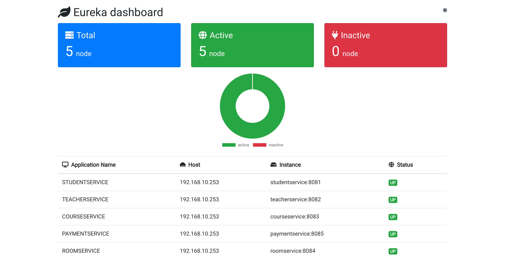
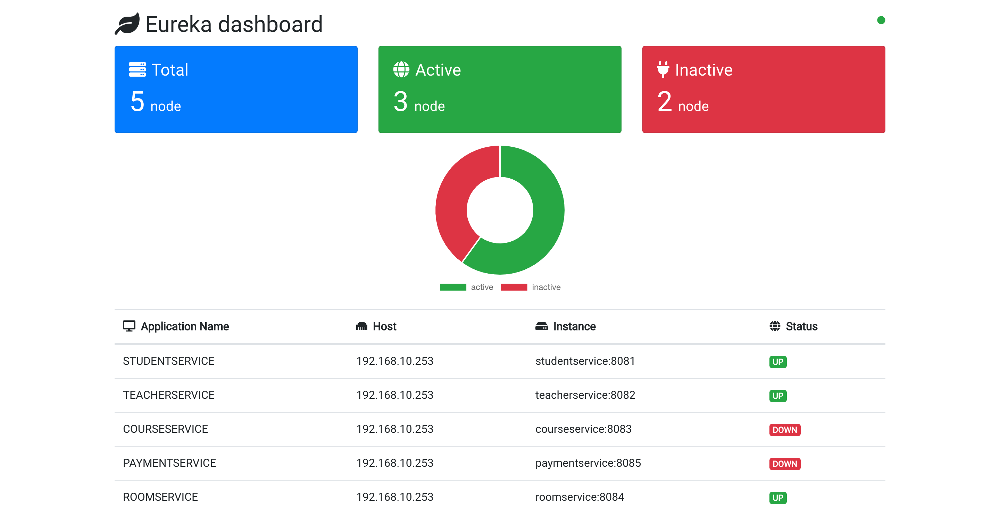

# Dashboard

## วิธีการรัน

1. Import Project JAVA
2. รัน service-discovery-server
3. รัน service ที่ต้องการ
4. เปิด terminal
5. พิมพ์ cd dashboard -> yarn && yarn start
6. เปิด http://localhost:3000/

## Services

- Student Service
- Teacher Service
- Course Service
- Room Service
- Payment Service

## Preview

 

### กลุ่ม S.O.Pang

- นางสาวเกศราณี ไตรสวัสดิ์วงศ์ รหัสนักศึกษา 61070018
- นายคุณากร โฆสิตสกุล รหัสนักศึกษา 61070020
- นางสาวฉัตรธิดา แจ้งใจ รหัสนักศึกษา 61070029
- นายชาญวิทย์ เศรษฐวงศ์สิน รหัสนักศึกษา 61070040
- นายนรรณจา โสวรรณ รหัสนักศึกษา 61070097
